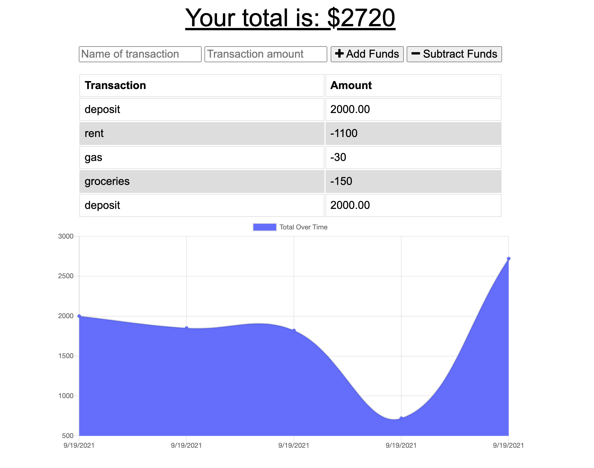

# Unit 19 PWA Homework: Online/Offline Budget Trackers

 

## Description
Budget tracker application using MongoDB and mongoose

## Live site
https://pacific-waters-70920.herokuapp.com/

## Screenshot

## Table of Contents
* [Installation](#installation)
* [License](#license)
## Installation

*Steps required to install this project and get the application running:*

npm i, npm start

## License
Open

### Questions?

For any questions, please contact me with the information below:

GitHub: [@AF-cmdZ](https://api.github.com/users/AF-cmdZ)
